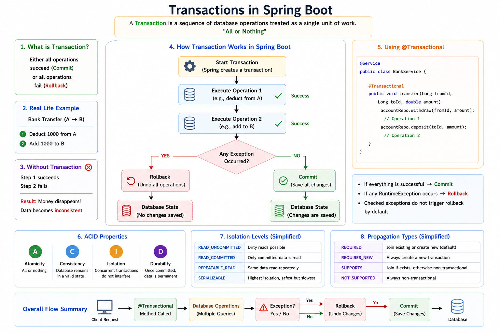
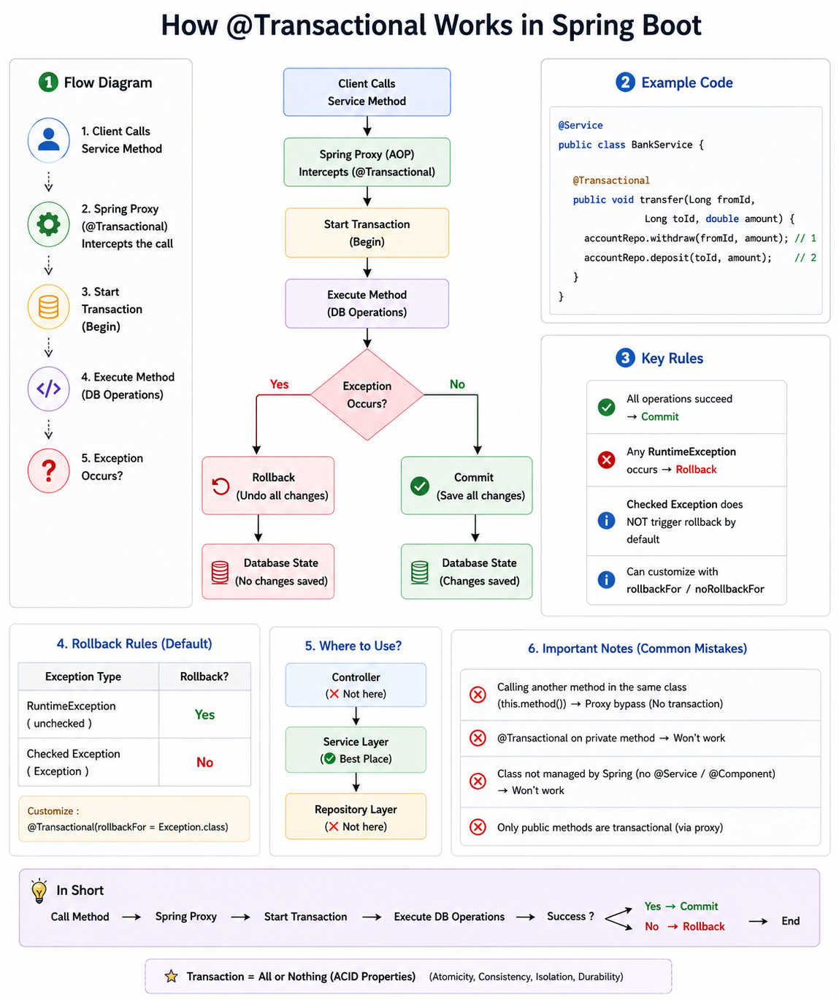

# Spring Boot Transactions & `@Transactional` Notes

## 1. Transaction ဆိုတာဘာလဲ?

**Transaction** ဆိုတာ database operations တွေကို **တစ်ခုတည်းသော unit** အနေနဲ့ run လုပ်တာပါ။

အဓိက idea က—

> **All or Nothing**

ဆိုလိုတာက operation အားလုံးအောင်မြင်ရင် **Commit** လုပ်မယ်။  
တစ်ခုခု fail ဖြစ်ရင် **Rollback** လုပ်ပြီး database ကို အရင်အခြေအနေပြန်ထားမယ်။

---

## 2. Simple Example: Bank Transfer

Bank transfer လုပ်တယ်ဆိုပါစို့—

1. Account A ကနေ 1000 ဖြတ်မယ်  
2. Account B ထဲကို 1000 ထည့်မယ်  

ဒီ operation ၂ ခုလုံးအောင်မြင်မှ transaction success ဖြစ်ပါတယ်။

### Without Transaction

Step 1 success ဖြစ်ပြီး Step 2 fail ဖြစ်သွားရင်—

- Account A ကငွေလျော့သွားမယ်
- Account B မှာငွေမဝင်ဘူး
- Data မမှန်တော့ဘူး

### With Transaction

Step 1 success ဖြစ်ပြီး Step 2 fail ဖြစ်သွားရင်—

- Spring Boot က rollback လုပ်မယ်
- Account A မှာငွေပြန်ရှိမယ်
- Database state မပျက်ဘူး

---

## 3. `@Transactional` ဆိုတာဘာလဲ?

`@Transactional` ဆိုတာ Spring Boot မှာ transaction ကို manage လုပ်ဖို့သုံးတဲ့ annotation ပါ။

```java
@Transactional
public void transferMoney() {
    // database operation 1
    // database operation 2
}
```

ဒီ method အတွင်းက database operation တွေကို Spring က transaction တစ်ခုအနေနဲ့ run ပေးပါတယ်။

---

## 4. `@Transactional` ဘယ်လိုအလုပ်လုပ်လဲ?

Spring Boot က `@Transactional` ကို **Spring Proxy / AOP** နဲ့ handle လုပ်ပါတယ်။

### Flow

```text
Client calls service method
        ↓
Spring Proxy intercepts method
        ↓
Transaction starts
        ↓
Database operations execute
        ↓
If success → Commit
If exception → Rollback
```

---

## 5. Example Code

```java
@Service
public class BankService {

    private final AccountRepository accountRepository;

    public BankService(AccountRepository accountRepository) {
        this.accountRepository = accountRepository;
    }

    @Transactional
    public void transfer(Long fromId, Long toId, double amount) {

        Account fromAccount = accountRepository.findById(fromId)
                .orElseThrow(() -> new RuntimeException("From account not found"));

        Account toAccount = accountRepository.findById(toId)
                .orElseThrow(() -> new RuntimeException("To account not found"));

        fromAccount.withdraw(amount);
        toAccount.deposit(amount);

        accountRepository.save(fromAccount);
        accountRepository.save(toAccount);
    }
}
```

### Explanation

ဒီ code ထဲမှာ—

- `fromAccount.withdraw(amount)` က Account A ထဲကငွေဖြတ်တယ်
- `toAccount.deposit(amount)` က Account B ထဲငွေထည့်တယ်
- operation အားလုံး success ဖြစ်ရင် commit
- RuntimeException ဖြစ်ရင် rollback

---

## 6. Commit ဆိုတာဘာလဲ?

**Commit** ဆိုတာ transaction အောင်မြင်ပြီး database changes တွေကို အမှန်တကယ် save လုပ်တာပါ။

```text
All operations success → Commit → DB changes saved
```

---

## 7. Rollback ဆိုတာဘာလဲ?

**Rollback** ဆိုတာ transaction fail ဖြစ်တဲ့အခါ database changes တွေကို cancel လုပ်တာပါ။

```text
Any operation fails → Rollback → DB changes canceled
```

---

## 8. Default Rollback Rule

Spring Boot မှာ default အနေနဲ့—

| Exception Type | Rollback? |
|---|---|
| RuntimeException | Yes |
| Checked Exception | No |

Checked exception တွေကိုပါ rollback လုပ်ချင်ရင်—

```java
@Transactional(rollbackFor = Exception.class)
public void transfer() throws Exception {
    // logic
}
```

---

## 9. `@Transactional` ကိုဘယ်မှာသုံးသင့်လဲ?

Best practice အနေနဲ့ **Service Layer** မှာသုံးသင့်ပါတယ်။

```text
Controller → Service → Repository → Database
              ↑
      @Transactional here
```

Service layer မှာ business logic ရှိပြီး database operation တစ်ခုထက်ပိုလုပ်တတ်လို့ပါ။

---

## 10. Common Mistakes

### 1. Private Method မှာသုံးတာ

```java
@Transactional
private void transfer() {
}
```

Private method မှာ transaction မအလုပ်လုပ်နိုင်ပါ။

### 2. Same Class ထဲက Method ကို `this.method()` နဲ့ခေါ်တာ

```java
public void methodA() {
    this.methodB();
}

@Transactional
public void methodB() {
}
```

ဒီလိုဆို Spring Proxy ကို bypass ဖြစ်နိုင်လို့ transaction မအလုပ်လုပ်နိုင်ပါ။

### 3. Spring Bean မဟုတ်တဲ့ Class မှာသုံးတာ

`@Service`, `@Component` စတာတွေမပါတဲ့ class မှာ `@Transactional` သုံးရင် Spring က manage မလုပ်နိုင်ပါ။

---

## 11. ACID Properties

| Property | Meaning |
|---|---|
| Atomicity | All or nothing |
| Consistency | Database remains valid |
| Isolation | Transactions do not disturb each other |
| Durability | Committed data is permanent |

---

## 12. Diagram

### Spring Boot Transactional Flow]


### @Transaction ]



---

## 13. Interview Answer

**English:**

`@Transactional` is used to manage database transactions in Spring Boot. It ensures that a group of database operations runs as a single unit. If all operations succeed, the transaction is committed. If a RuntimeException occurs, the transaction is rolled back. Spring handles this using proxy-based AOP.

**Myanmar:**

`@Transactional` ဆိုတာ Spring Boot မှာ database transaction တွေကို manage လုပ်ဖို့သုံးတဲ့ annotation ဖြစ်ပါတယ်။ Method တစ်ခုထဲက database operation တွေကို single unit အဖြစ် run လုပ်ပေးပြီး အားလုံးအောင်မြင်ရင် commit လုပ်ပါတယ်။ RuntimeException ဖြစ်ရင် rollback လုပ်ပါတယ်။ Spring က ဒါကို Proxy/AOP နဲ့ handle လုပ်ပါတယ်။

---

## 14. Quick Memory

```text
@Transactional = Start transaction
Success = Commit
Fail = Rollback
```
