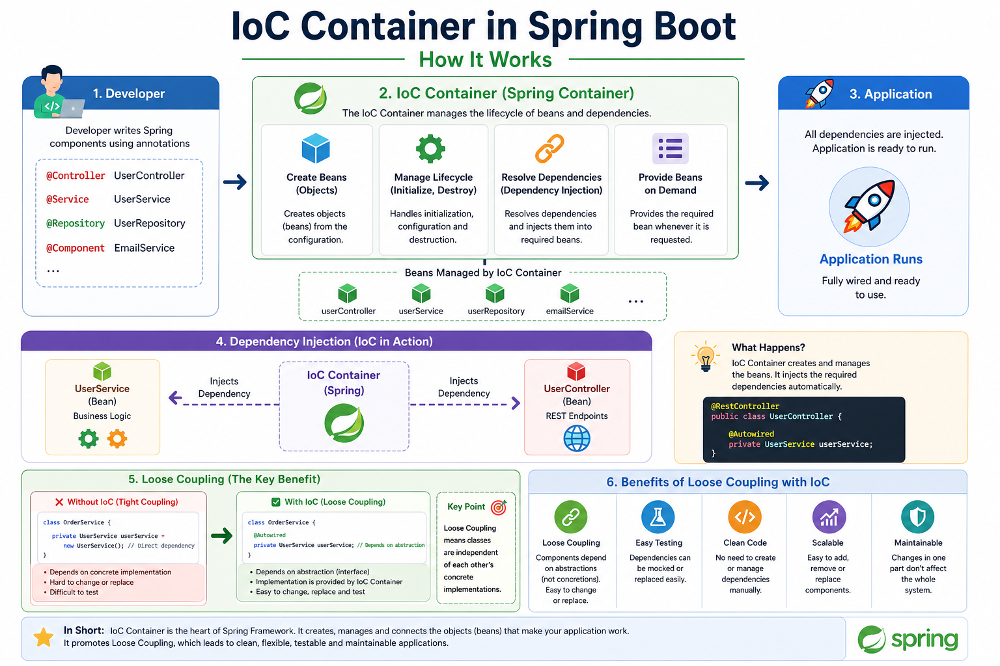

# 📦 IoC Container in Spring Boot

## 📌 What is IoC Container?

**IoC (Inversion of Control)** ဆိုတာ  
Object creation နဲ့ dependency management ကို developer ကိုယ်တိုင်မလုပ်တော့ဘဲ **Spring Framework ကို control လွှဲပေးတာ** ဖြစ်ပါတယ်။

Spring ထဲမှာ ဒီ object တွေကို create လုပ်၊ manage လုပ်၊ inject လုပ်ပေးတဲ့နေရာကို **IoC Container** လို့ခေါ်ပါတယ်။

---

## 🧠 Simple Explanation

Traditional Java မှာ object ကို ကိုယ်တိုင် create လုပ်ရပါတယ်။

```java
UserService userService = new UserService();
```

Spring Boot မှာတော့ Spring IoC Container က object ကို create လုပ်ပေးပြီး လိုတဲ့ class ထဲကို inject လုပ်ပေးပါတယ်။

```java
@Autowired
private UserService userService;
```

👉 Developer က object creation ကို မစီမံတော့ဘူး  
👉 Spring က create + manage + inject လုပ်ပေးတယ်

---

## 📊 Diagram



---

## 🌍 Real-world Example

ဥပမာ — **Restaurant Ordering System** တစ်ခုစဉ်းစားကြည့်ပါ။

Customer က order တင်တယ်။  
OrderService က payment လုပ်ဖို့ PaymentService ကိုလိုတယ်။

### ❌ Without IoC

OrderService ထဲမှာ PaymentService ကို direct create လုပ်ထားတယ်။

```java
public class OrderService {

    private PaymentService paymentService = new PaymentService();

    public void placeOrder() {
        paymentService.pay();
        System.out.println("Order placed successfully");
    }
}
```

ဒီလိုရေးရင် `OrderService` က `PaymentService` ကို တိုက်ရိုက်မှီခိုနေပါတယ်။

### Problem

- PaymentService ပြောင်းချင်ရင် OrderService code ကိုပြန်ပြင်ရမယ်
- Testing လုပ်ရခက်တယ်
- Tight coupling ဖြစ်တယ်
- Code maintain လုပ်ရခက်တယ်

---

## ✅ With IoC Container

Spring က PaymentService object ကို create လုပ်ပြီး OrderService ထဲကို inject လုပ်ပေးမယ်။

---

## 🧩 Sample Code

### 1. PaymentService Interface

```java
public interface PaymentService {
    void pay();
}
```

---

### 2. KBZPayService Implementation

```java
import org.springframework.stereotype.Service;

@Service
public class KBZPayService implements PaymentService {

    @Override
    public void pay() {
        System.out.println("Payment made with KBZPay");
    }
}
```

---

### 3. OrderService

```java
import org.springframework.stereotype.Service;

@Service
public class OrderService {

    private final PaymentService paymentService;

    public OrderService(PaymentService paymentService) {
        this.paymentService = paymentService;
    }

    public void placeOrder() {
        paymentService.pay();
        System.out.println("Order placed successfully");
    }
}
```

---

### 4. OrderController

```java
import org.springframework.web.bind.annotation.GetMapping;
import org.springframework.web.bind.annotation.RestController;

@RestController
public class OrderController {

    private final OrderService orderService;

    public OrderController(OrderService orderService) {
        this.orderService = orderService;
    }

    @GetMapping("/order")
    public String order() {
        orderService.placeOrder();
        return "Order completed";
    }
}
```

---

## 🔁 How IoC Works in This Example

```text
Developer writes classes with annotations

@Service
KBZPayService
OrderService

@RestController
OrderController

        ↓

Spring IoC Container scans classes

        ↓

Spring creates Beans

        ↓

Spring injects PaymentService into OrderService

        ↓

Spring injects OrderService into OrderController

        ↓

Application runs
```

---

## 🧠 Important Keywords

## 1. Bean

Spring IoC Container က manage လုပ်နေတဲ့ object ကို **Bean** လို့ခေါ်ပါတယ်။

```java
@Service
public class OrderService {
}
```

ဒီ `OrderService` object ကို Spring က Bean အနေနဲ့ manage လုပ်ပါတယ်။

---

## 2. Dependency

Class တစ်ခု အလုပ်လုပ်ဖို့လိုအပ်တဲ့ အခြား object ကို **Dependency** လို့ခေါ်ပါတယ်။

Example:

```java
public class OrderService {

    private final PaymentService paymentService;
}
```

ဒီမှာ `PaymentService` က `OrderService` ရဲ့ dependency ဖြစ်ပါတယ်။

---

## 3. Dependency Injection

Dependency object ကို class ထဲကို Spring က ထည့်ပေးတာကို **Dependency Injection** လို့ခေါ်ပါတယ်။

```java
public OrderService(PaymentService paymentService) {
    this.paymentService = paymentService;
}
```

ဒါက **Constructor Injection** ဖြစ်ပါတယ်။

---

## 🔒 Tight Coupling vs Loose Coupling

## ❌ Tight Coupling

```java
private PaymentService paymentService = new KBZPayService();
```

`OrderService` က `KBZPayService` ကို တိုက်ရိုက်မှီခိုနေတယ်။

အားနည်းချက်များ:

- Implementation ပြောင်းရခက်တယ်
- Testing ခက်တယ်
- Code flexible မဖြစ်ဘူး

---

## ✅ Loose Coupling

```java
private final PaymentService paymentService;

public OrderService(PaymentService paymentService) {
    this.paymentService = paymentService;
}
```

`OrderService` က concrete class ကိုမမှီခိုဘဲ interface ကိုမှီခိုတယ်။

အားသာချက်များ:

- Implementation ပြောင်းရလွယ်တယ်
- Testing လုပ်ရလွယ်တယ်
- Code maintain လုပ်ရလွယ်တယ်
- Scalable ဖြစ်တယ်

---

## 🔄 Changing Implementation Example

နောက်ပိုင်း KBZPay အစား WavePay သုံးချင်တယ်ဆိုပါစို့။

### WavePayService

```java
import org.springframework.context.annotation.Primary;
import org.springframework.stereotype.Service;

@Service
@Primary
public class WavePayService implements PaymentService {

    @Override
    public void pay() {
        System.out.println("Payment made with WavePay");
    }
}
```

Spring က `WavePayService` ကို inject လုပ်ပေးနိုင်ပါတယ်။  
`OrderService` code ကို ပြန်ပြင်စရာမလိုပါဘူး။

---

## 🚀 Why IoC Container is Useful

- Object creation ကို Spring က handle လုပ်ပေးတယ်
- Dependencies တွေကို auto inject လုပ်ပေးတယ်
- Loose coupling ဖြစ်စေတယ်
- Testing လုပ်ရလွယ်တယ်
- Code maintain လုပ်ရလွယ်တယ်
- Large project တွေအတွက် structure ပိုကောင်းတယ်

---

## 🎯 Interview Answer

**IoC Container** ဆိုတာ Spring Framework ထဲမှာ object creation, object lifecycle, dependency injection တွေကို manage လုပ်ပေးတဲ့ container ဖြစ်ပါတယ်။ Developer က object တွေကို ကိုယ်တိုင် `new` နဲ့ create မလုပ်တော့ဘဲ Spring က Bean တွေ create လုပ်ပြီး လိုအပ်တဲ့ class ထဲကို inject လုပ်ပေးပါတယ်။ ဒီလိုလုပ်ခြင်းအားဖြင့် loose coupling, easy testing, clean code နဲ့ maintainability ပိုကောင်းလာပါတယ်။

---

## 🧩 Summary

IoC Container = Spring ရဲ့ object manager

Spring IoC Container က:

```text
Create Beans
Manage Bean Lifecycle
Resolve Dependencies
Inject Dependencies
Run Application
```

👉 Simple meaning:  
**You do not create objects manually. Spring creates and gives them to you.**
