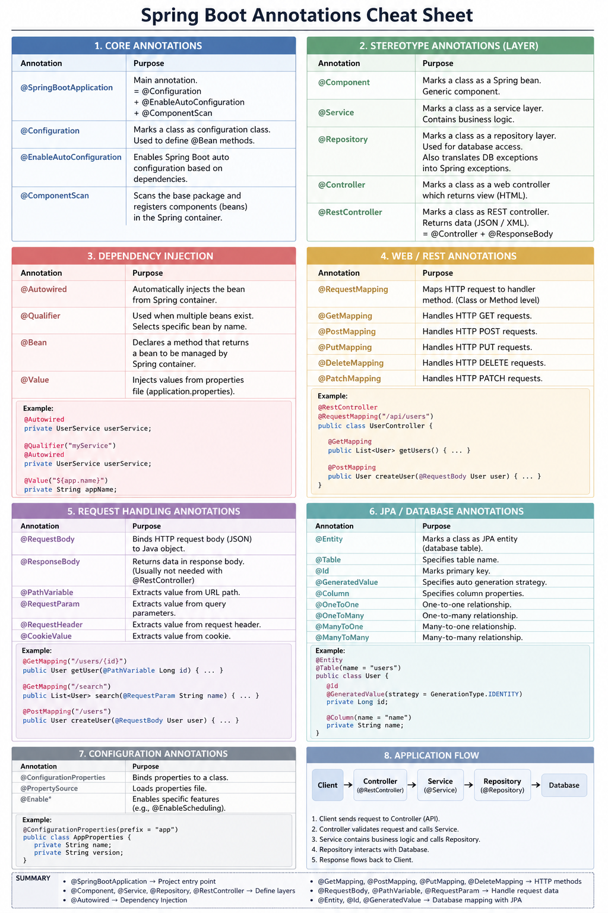

# Spring Boot Annotations – Detailed Notes

## What is Annotation?
Annotation ဆိုတာ Java code ထဲမှာ @ နဲ့ရေးတဲ့ metadata ဖြစ်ပြီး  
Spring ကို “ဒီ class / method ကို ဘယ်လို handle လုပ်ရမလဲ” ဆိုတာညွှန်ကြားပေးပါတယ်။  

XML configuration မလိုတော့ဘဲ code နဲ့ configuration လုပ်နိုင်ပါတယ်။

---

## @SpringBootApplication

Main annotation ဖြစ်ပြီး application start point ဖြစ်ပါတယ်။

ပါဝင်တာများ:
- @Configuration → Config class
- @EnableAutoConfiguration → Auto setup based on dependencies
- @ComponentScan → Package scan & bean creation

---

## @Component

Class တစ်ခုကို Spring container ထဲမှာ bean အဖြစ် register လုပ်ပေးပါတယ်။

---

## @Service

Business logic layer အတွက်သုံးပါတယ်။  
Controller ထဲမှာ logic မရေးဘဲ service ထဲမှာရေးသင့်ပါတယ်။

---

## @Repository

Database access layer အတွက်ဖြစ်ပါတယ်။  
CRUD operations တွေကို handle လုပ်ပါတယ်။

---

## @RestController

REST API create လုပ်ဖို့သုံးပါတယ်။  
Return value ကို JSON အဖြစ်ပြန်ပေးပါတယ်။

---

## @Autowired (Dependency Injection)

Bean ကို auto inject လုပ်ပေးပါတယ်။

Example:
UserController → UserService ကို auto ထည့်ပေးတယ်

Best practice → constructor injection

---

## Web Mapping Annotations

- @GetMapping → GET request
- @PostMapping → POST request
- @PutMapping → UPDATE
- @DeleteMapping → DELETE

---

## Request Handling

- @RequestBody → JSON → Object
- @ResponseBody → Object → JSON
- @PathVariable → URL param
- @RequestParam → Query param

---

## JPA Annotations

- @Entity → Table
- @Table → Table name
- @Id → Primary key
- @GeneratedValue → Auto increment

---

## Flow

Request → Controller → Service → Repository → Database → Response

---

## Summary

Spring Boot annotations:
- Reduce XML configuration
- Enable auto configuration
- Support dependency injection
- Help build REST APIs easily

---

## Cheat Sheet Image

## Reference
https://www.geeksforgeeks.org/springboot/spring-boot-annotations/ 
