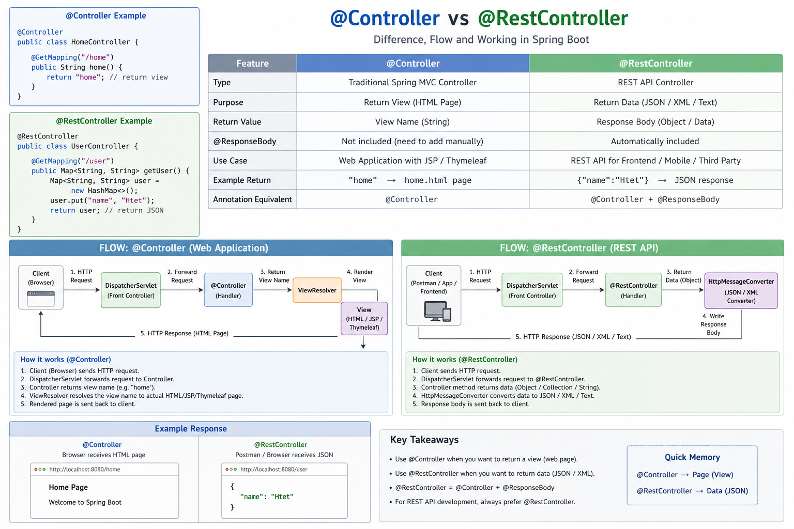

# @Controller vs @RestController (Diagram + Flow)

## Overview

**@Controller**
- Returns View (HTML page)
- Used for traditional web applications (JSP, Thymeleaf)

**@RestController**
- Returns Data (JSON/XML/Text)
- Used for REST APIs (Frontend, Mobile, etc.)

---

## Key Difference

| Feature | @Controller | @RestController |
|--------|------------|----------------|
| Return Type | View (HTML) | Data (JSON) |
| @ResponseBody | Manual | Automatic |
| Use Case | Web Page | API |

---

## Flow Diagram



---

## Flow Explanation

### @Controller Flow

1. Client (Browser) sends request  
2. DispatcherServlet receives request  
3. Controller handles request  
4. Returns View Name  
5. ViewResolver maps to HTML  
6. HTML page returned  

---

### @RestController Flow

1. Client (App/Postman) sends request  
2. DispatcherServlet receives request  
3. RestController handles request  
4. Returns Object/Data  
5. HttpMessageConverter converts to JSON  
6. JSON response returned  

---

## Example

### @Controller

```java
@Controller
public class HomeController {
    @GetMapping("/home")
    public String home() {
        return "home"; // returns HTML page
    }
}
```

---

### @RestController

```java
@RestController
public class UserController {
    @GetMapping("/user")
    public String getUser() {
        return "Hello"; // returns JSON/text
    }
}
```

---

## Summary

- @Controller → View (HTML)
- @RestController → Data (JSON)
- @RestController = @Controller + @ResponseBody
