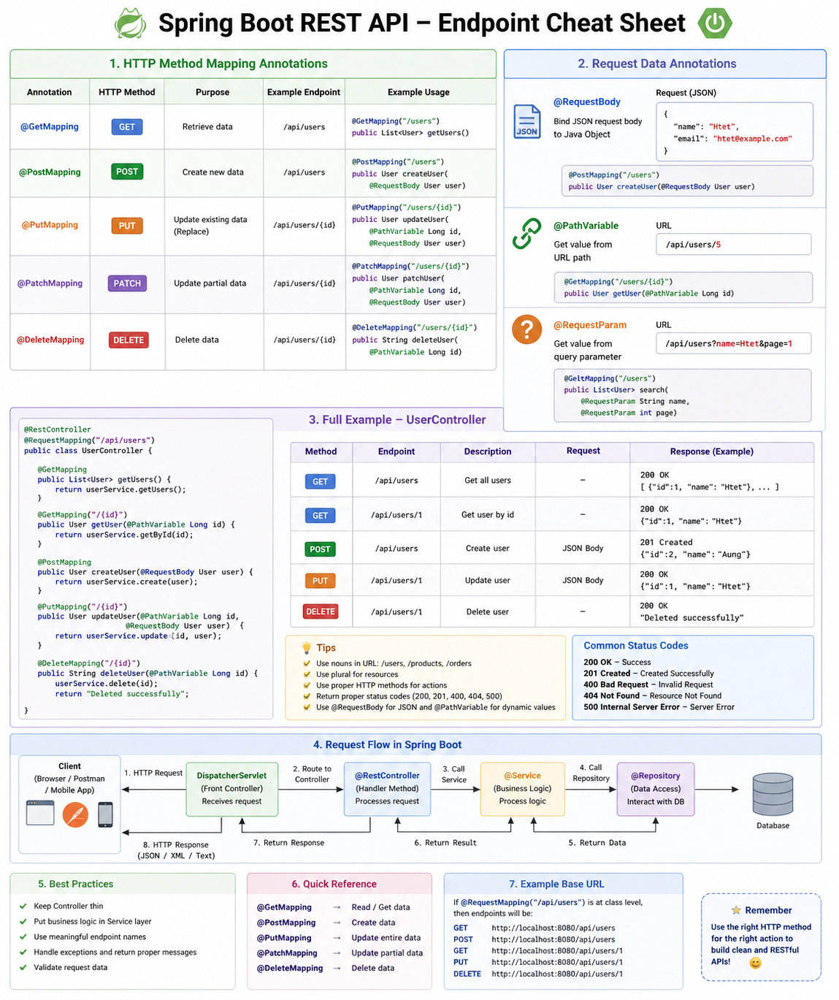

# Spring Boot API Endpoints 

## Overview

Spring Boot provides annotations to create REST API endpoints easily.

---

## HTTP Method Mapping

| Annotation | Method | Purpose |
|------------|--------|--------|
| @GetMapping | GET | Retrieve data |
| @PostMapping | POST | Create data |
| @PutMapping | PUT | Update data |
| @DeleteMapping | DELETE | Delete data |

---

## Request Handling

### @RequestBody
Convert JSON → Java Object

### @PathVariable
Get value from URL

Example:
GET /users/1 → id = 1

### @RequestParam
Get query parameter

Example:
GET /users?name=Htet

---

## Example Controller

```java
@RestController
@RequestMapping("/api/users")
public class UserController {

    @GetMapping
    public String getUsers() {
        return "Get users";
    }

    @GetMapping("/{id}")
    public String getUser(@PathVariable Long id) {
        return "User id: " + id;
    }

    @PostMapping
    public String createUser(@RequestBody User user) {
        return "Created";
    }

    @PutMapping("/{id}")
    public String updateUser(@PathVariable Long id, @RequestBody User user) {
        return "Updated";
    }

    @DeleteMapping("/{id}")
    public String deleteUser(@PathVariable Long id) {
        return "Deleted";
    }
}
```

---

## Request Flow

Client → DispatcherServlet → Controller → Service → Repository → Database → Response

---

## Cheat Sheet Diagram



---

## Summary

- Use correct HTTP method
- Use @RequestBody for JSON
- Use @PathVariable for dynamic URL
- Use @RequestParam for query params
