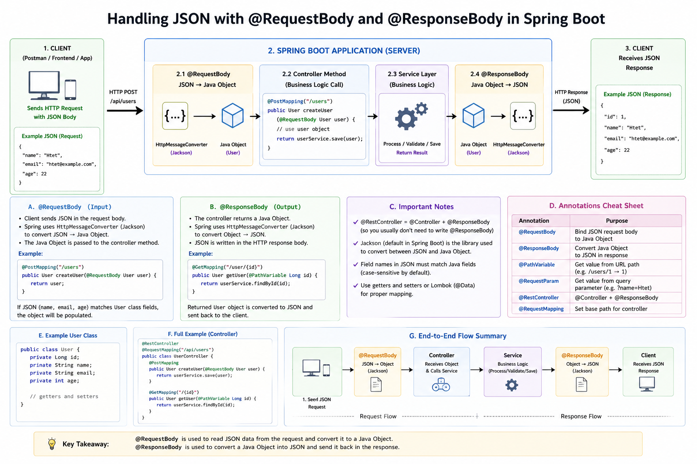

# Handling JSON with @RequestBody and @ResponseBody

## Overview

Spring Boot handles JSON automatically using annotations.

- `@RequestBody` → JSON ➜ Java Object  
- `@ResponseBody` → Java Object ➜ JSON  

---

## Example Flow

### Request (Client → Server)

```json
{
  "name": "Htet",
  "email": "htet@example.com"
}
```

```java
@PostMapping("/users")
public User createUser(@RequestBody User user) {
    return user;
}
```

---

## Response (Server → Client)

```java
@GetMapping("/user")
@ResponseBody
public User getUser() {
    return new User("Htet", "htet@example.com");
}
```

```json
{
  "name": "Htet",
  "email": "htet@example.com"
}
```

---

## Full Flow

Client (JSON)  
↓  
@RequestBody (convert JSON → Object)  
↓  
Controller → Service → Logic  
↓  
@ResponseBody (convert Object → JSON)  
↓  
Client receives JSON  

---

## Important Notes

- `@RestController` already includes `@ResponseBody`
- Field names must match JSON keys
- Need getters/setters (or Lombok)

---

## Diagram



---

## Summary

- RequestBody = Input  
- ResponseBody = Output  
- JSON ↔ Object conversion automatic (Jackson)
