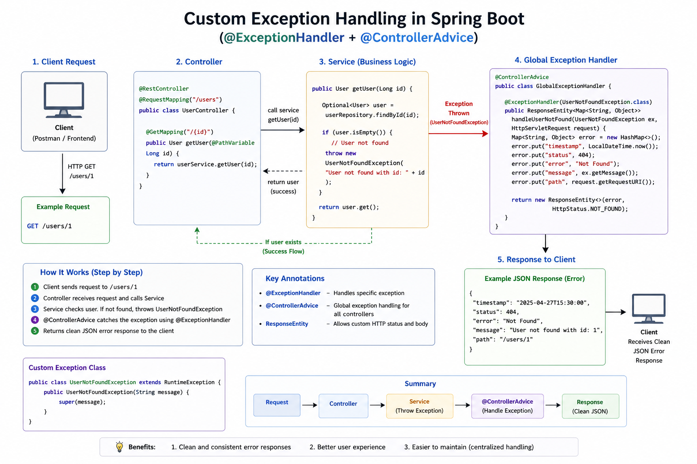

# Custom Exception Handling in Spring Boot

## Overview

Custom exceptions allow you to return clean and meaningful error responses instead of default server errors.

---

## Key Concepts

- Create your own exception class  
- Throw exception when error occurs  
- Handle exception using @ExceptionHandler  
- Use @ControllerAdvice for global handling  

---

## Step 1: Custom Exception

```java
public class UserNotFoundException extends RuntimeException {
    public UserNotFoundException(String message) {
        super(message);
    }
}
```

---

## Step 2: Throw Exception

```java
public User getUser(Long id) {
    return repository.findById(id)
        .orElseThrow(() -> new UserNotFoundException("User not found"));
}
```

---

## Step 3: Handle Exception (Global)

```java
@ControllerAdvice
public class GlobalExceptionHandler {

    @ExceptionHandler(UserNotFoundException.class)
    public ResponseEntity<String> handleError(UserNotFoundException ex) {
        return new ResponseEntity<>(ex.getMessage(), HttpStatus.NOT_FOUND);
    }
}
```

---

## Flow

Client → Controller → Service  
        ↓  
   throw Exception  
        ↓  
@ControllerAdvice  
        ↓  
Return clean JSON response  

---

## Example Response

```json
{
  "message": "User not found",
  "status": 404
}
```

---

## Diagram



---

## Summary

- Custom Exception = your own error class  
- @ExceptionHandler = handle specific error  
- @ControllerAdvice = global error handler

## Reference
https://www.baeldung.com/exception-handling-for-rest-with-spring
