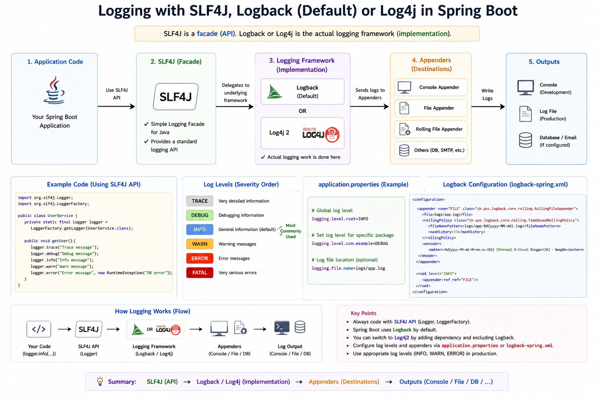

# Logging in Spring Boot (SLF4J, Logback, Log4j)

## Overview

Spring Boot uses logging to track application behavior, debug issues, and monitor production systems.

---

## Logging Tools

- **SLF4J** → Logging API (Facade)
- **Logback** → Default logging implementation
- **Log4j** → Alternative logging framework

---

## Relationship

SLF4J (API) → Logback / Log4j (Implementation)

---

## Basic Example

```java
import org.slf4j.Logger;
import org.slf4j.LoggerFactory;

public class UserService {

    private static final Logger logger = LoggerFactory.getLogger(UserService.class);

    public void getUser() {
        logger.info("User API called");
        logger.error("Error example");
    }
}
```

---

## Log Levels

- TRACE → Detailed logs  
- DEBUG → Debugging  
- INFO → General info  
- WARN → Warning  
- ERROR → Error  

---

## Configuration (application.properties)

```properties
logging.level.root=INFO
logging.level.com.example=DEBUG
logging.file.name=app.log
```

---

## Logback Configuration (logback-spring.xml)

```xml
<configuration>
    <appender name="FILE" class="ch.qos.logback.core.FileAppender">
        <file>app.log</file>
        <encoder>
            <pattern>%d{yyyy-MM-dd HH:mm:ss} - %msg%n</pattern>
        </encoder>
    </appender>

    <root level="INFO">
        <appender-ref ref="FILE"/>
    </root>
</configuration>
```

---

## Logging Flow

Code → SLF4J → Logback / Log4j → Appenders → Output (Console / File)

---

## Diagram



---

## Summary

- SLF4J = API  
- Logback = Default engine  
- Logging helps debug and monitor applications  
